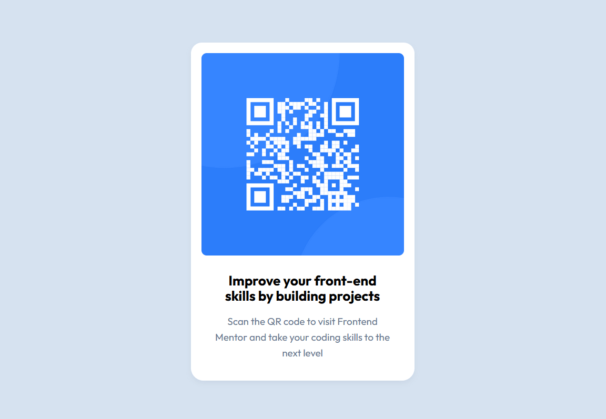

# Frontend Mentor - QR code component solution

This is a solution to the [QR code component challenge on Frontend Mentor](https://www.frontendmentor.io/challenges/qr-code-component-iux_sIO_H).

## Table of contents

- [Overview](#overview)
  - [Screenshot](#screenshot)
  - [Links](#links)
- [My process](#my-process)
  - [Built with](#built-with)
  - [What I learned](#what-i-learned)
  - [Continued development](#continued-development)
  - [Useful resources](#useful-resources)
  - [AI Collaboration](#ai-collaboration)
- [Author](#author)
- [Acknowledgments](#acknowledgments)

## Overview

The QR code component is a static QR output card with a heading and a description which states that the QR code links to the Frontend Mentor page. This project has a scope to learn about the card layout and centering the card on the webpage.

### Screenshot

- Mobile View


- Desktop View



### Links

- Solution URL: [Checkout solution URL [Frontend Mentor]](https://www.frontendmentor.io/solutions/qr-code-component-q0JeXtH38n)
- Live Site URL: [Checkout live site URL](https://magical-hope.github.io/qr-code-component/)

## My process

- I started with the mobile-first appoach.
- First I thought about the layout.
- Decided to have a `<main>`, then a `<section>` as a container with max-width 1440 px.
- Then I created a card with `<article>`, I wanted to use semantic html.
- Inside the `<article>` I created a `` inside a `<div>` wrapper, `<h3>` for the title and `<p>` for description.
- I used aria-labels, proper class, id names.
- Then I setup CSS with color-pallete and variables.
- Next I set root and body elements, used CSS grid to center the QR card.
- I applied styling using CSS and added media-queries for responsiveness.
- Next I shared my code on Github and deployed the project live on Github Pages for everyone to view.
- Then I submitted the solution on Frontend Mentor.
- Finally updated and shared the README file documentation on Github.

### Built with

- Semantic HTML5 markup
- CSS custom properties
- CSS Grid
- Responsive Layout
- Mobile-first workflow
- Accessibility
- Coding best practices

### What I learned

I learnt to think in layout, structure using semantic html markup, follow accessibility, maintainability, responsiveness, mobile-first workflow best practices.

- Some html code that I'am proud of:

```html
<article class="qr-output-wrapper" aria-labelledby="qr-output-heading">
  <div class="qr-img-wrapper">
    
  </div>
  <h3 id="qr-output-heading">H3 heading</h3>
  <p id="qr-description">description</p>
</article>
```
- Some CSS code that I'am proud of:

```css
:root {
    /* Brand/Accent Palette */
    --black-700: black;

    /* Neutral Palette */
    --white-700: hsl(0, 0%, 100%);
    --slate-300: hsl(212, 45%, 89%);
    --slate-500: hsl(216, 15%, 48%);
    --slate-900: hsl(216, 15%, 48%, 0.1);

    /* Accent */
    --color-accent-text: var(--black-700);

    /* Neutrals */
    --color-neutral-bg: var(--slate-300);
    --color-neutral-surface: var(--white-700);
    --color-neutral-box-shadow: var(--slate-900);
    --color-neutral-text-muted: var(--slate-500);

    /* border radius */
    --border-radius-1: 1.05rem;
    --border-radius-2: 1.2rem;

    /* padding */
    --padding-1: 1rem;
    --padding-2: 1.05rem;
}
```

### Continued development

I want to continue learning and implementing about CSS variables, BEM naming best practices, setting up base CSS styles. I want to know the real-world dynamic implementation and workflow of the QR code component. I want to know how can I incorporate AI into my workflow. Requesting feedback on what I did well, what I did incorrectly and what can be improved.

### Useful resources

- [Free Code camp](https://www.freecodecamp.org/learn/responsive-web-design-v9/) - This helped me practice html, css.
- [Bad Website Club](https://badwebsite.club/) - This is an amazing html, css free bootcamp.

### AI Collaboration

I did not use AI for this project.

## Author

- Author - Magical Hope
- Frontend Mentor - [@magical-hope](https://www.frontendmentor.io/profile/magical-hope)

## Acknowledgments

I would like to Thank freecodecamp, Bad Website Club for sharing knowledge and coding best practices, Thanks to Frontend Mentor to give this opportunity to me and the wonderful community which learns, shares and grows together.

